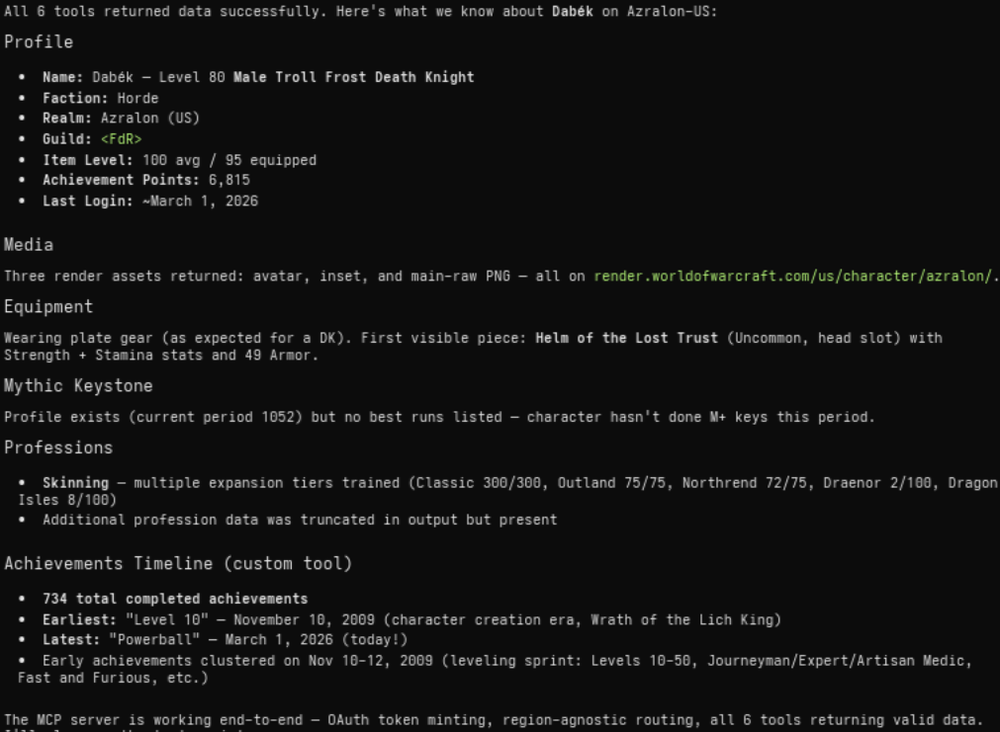

# wow-mcp

MCP server that wraps the **complete World of Warcraft retail API** (Game Data + Profile) as 197 MCP tools. Authenticates via OAuth 2.0 client credentials and is fully **region-agnostic** — every tool accepts `region` and `locale` as optional parameters, so a single server instance can query any region.




## Quick start

```bash
cp .env.example .env
# Fill in BNET_CLIENT_ID and BNET_CLIENT_SECRET

npm install
npm run build
npm start          # stdio transport
```

### Development

```bash
npm run dev        # runs via tsx (no build step)
npm run inspect    # opens MCP Inspector UI
npm run lint       # type-check only
```

## API coverage

All 196 retail WoW endpoints are registered as individual MCP tools, plus one custom computed tool:

- **Game Data API** — 161 tools covering achievements, auctions, azerite essences, connected realms, covenants, creatures, guild crests, heirlooms, items, journals, media, modified crafting, mounts, mythic keystones, mythic raid leaderboards, pets, playable classes, playable races, playable specializations, power types, professions, PvP seasons, PvP tiers, quests, realms, regions, reputations, search endpoints, spells, talents, tech talents, titles, toys, and WoW tokens.
- **Profile API** — 35 tools for character profiles, achievements, appearance, collections, dungeons, encounters, equipment, hunter pets, media, mythic keystone profile, professions, PvP, quests, reputations, soulbinds, specializations, statistics, titles, and guild endpoints.
- **Custom** — `wow_character_achievementsTimeline` builds a chronologically sorted timeline of completed achievements (computed, not a raw Blizzard endpoint).

### Region & locale

Every tool accepts two optional parameters:

- `region` — `"us"` (default), `"eu"`, `"kr"`, or `"tw"`
- `locale` — `"en_US"` (default), or any locale supported by the target region (e.g. `"es_MX"`, `"de_DE"`, `"fr_FR"`, `"ko_KR"`)

No region configuration is needed in the environment. The same Battle.net credentials work across all regions.

## Environment variables

See [`.env.example`](.env.example). Only two are required:

- `BNET_CLIENT_ID` — Battle.net OAuth client ID
- `BNET_CLIENT_SECRET` — Battle.net OAuth client secret

Optional tuning:

- `LOG_LEVEL` — pino log level (default: `info`)
- `HTTP_TIMEOUT_MS` — request timeout (default: `15000`)
- `HTTP_RETRY_LIMIT` — retry count (default: `2`)
- `CACHE_TTL_SECONDS` — response cache TTL (default: `300`)
- `CACHE_SIZE` — max cached entries (default: `500`)

## Docker

```bash
docker compose build
docker compose up -d
```

Secrets are injected via `.env` on the host (not committed). The container runs as a non-root user with production dependencies only.

## Architecture

```
src/
  index.ts                          # MCP bootstrap (stdio)
  config/
    env.ts                          # zod env parsing (credentials + tuning)
    regions.ts                      # region enum, API hosts, OAuth URL
  mcp/
    tools.ts                        # auto-registers all endpoints + custom tools
    schemas.ts                      # shared zod input schemas
  blizzard/
    tokenManager.ts                 # OAuth client-credentials + single-flight
    client.ts                       # got wrapper: bearer injection, cache, 401 retry
    endpoints/
      types.ts                      # EndpointDef interface, buildPath(), schema helpers
      gamedata.ts                   # 161 Game Data API endpoint definitions
      profileEndpoints.ts           # 35 Profile API endpoint definitions
    schemas/
      characterSchemas.ts           # zod response schemas
      achievementSchemas.ts
    dto/
      characterDto.ts               # normalized character DTO
      timeline.ts                   # achievement timeline builder
  util/
    http.ts                         # got defaults
    cache.ts                        # TTL cache
    logger.ts                       # pino (stderr)
```

Endpoints are defined declaratively in `gamedata.ts` and `profileEndpoints.ts`. Each entry specifies a tool name, path template, namespace type, and zod input schema. The `tools.ts` module iterates over the registry and auto-registers every entry as an MCP tool, injecting `region` and `locale` parameters automatically.
